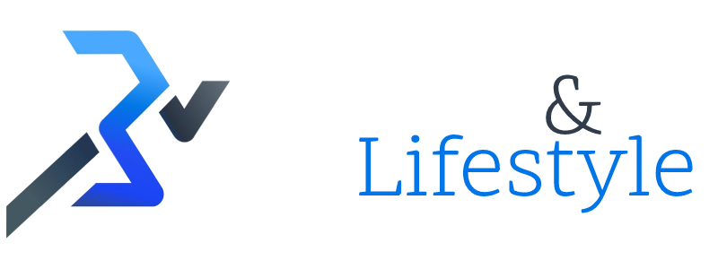

<a name="readme-top"></a>

[![Contributors][contributors-shield]][contributors-url]
[![Forks][forks-shield]][forks-url]
[![Stargazers][stars-shield]][stars-url]
[![Issues][issues-shield]][issues-url]
[![MIT License][license-shield]][license-url]
[![LinkedIn][linkedin-shield]][linkedin-url]

<!-- PROJECT LOGO -->
<br />
<div align="center">
  <a href="https://github.com/wajdi-amer/fitness_app">
    
  </a>

<h3 align="center">Fitness & Lifestyle</h3>

  <p align="center">
    Become the Best Version of Yourself!
    <br />
    <a href="https://github.com/wajdi-amer/fitness_app"><strong>Explore the docs »</strong></a>
    <br />
    <br />
    <a href="https://github.com/wajdi-amer/fitness_app">View Demo</a>
    ·
    <a href="https://github.com/wajdi-amer/fitness_app/issues">Report Bug</a>
    ·
  </p>
</div>


<!-- TABLE OF CONTENTS -->
<details>
  <summary>Table of Contents</summary>
  <ol>
    <li>
      <a href="#about-the-project">About The Project</a>
      <ul>
        <li><a href="#built-with">Built With</a></li>
      </ul>
    </li>
    <li>
      <a href="#getting-started">Getting Started</a>
      <ul>
        <li><a href="#prerequisites">Prerequisites</a></li>
        <li><a href="#installation">Installation</a></li>
      </ul>
    </li>
    <li><a href="#usage">Usage</a></li>
    <li><a href="#roadmap">Roadmap</a></li>
    <li><a href="#contributing">Contributing</a></li>
    <li><a href="#license">License</a></li>
    <li><a href="#contact">Contact</a></li>
    <li><a href="#acknowledgments">Acknowledgments</a></li>
  </ol>
</details>


<!-- ABOUT THE PROJECT -->
## About The Project

[![Product Name Screen Shot][product-screenshot]](https://example.com)

Here's a blank template to get started: To avoid retyping too much info. Do a search and replace with your text editor for the following:

<p align="right">(<a href="#readme-top">back to top</a>)</p>


### Built With

* [![React][React.js]][React-url]
* [![Bootstrap][Bootstrap.com]][Bootstrap-url]
* [![MUI][MUI-badge]][MUI-url]


<p align="right">(<a href="#readme-top">back to top</a>)</p>


<!-- GETTING STARTED -->
## Getting Started

To get a local copy up and running follow these simple example steps.

<br/>

### Prerequisites

* npm
  ```sh
  npm install npm@latest -g
  ```

### Installation

1. Get a free API Key at [RapidAPI](https://rapidapi.com/) & [API Ninjas](https://api-ninjas.com/)
2. Clone the repo
   ```sh
   git clone https://github.com/wajdi-amer/fitness_app.git
   ```
3. Install NPM packages
   ```sh
   npm install
   ```
4. Enter your API keys in `/client/env.sample` and rename the file to `.env`
   ```js
   REACT_APP_RAPID_API_KEY=

   REACT_APP_NINJA_API_KEY=
   ```
5. Navigate to the client folder, and run NPM start
    ```
      cd ./client/
      npm start
    ```

<p align="right">(<a href="#readme-top">back to top</a>)</p>


<!-- USAGE EXAMPLES -->
## Usage

Use this space to show useful examples of how a project can be used. Additional screenshots, code examples and demos work well in this space. You may also link to more resources.

_For more examples, please refer to the [Documentation](https://example.com)_

<p align="right">(<a href="#readme-top">back to top</a>)</p>


<!-- ROADMAP -->
## Roadmap

- [x] Basic Lifestyle Calculators
    - [x] BMI
    - [x] BMR
- [x] Food Nutrition Facts 
- [x] Exploring Thousands of Exercises 
- [ ] Signing Up & Working out
    - [ ] Nested Feature

See the [open issues](https://github.com/wajdi-amer/fitness_app/issues) for a full list of proposed features (and known issues).

<p align="right">(<a href="#readme-top">back to top</a>)</p>


<!-- CONTRIBUTING -->
## Contributing

Contributions are what make the open source community such an amazing place to learn, inspire, and create. Any contributions you make are **greatly appreciated**.

If you have a suggestion that would make this better, please fork the repo and create a pull request. You can also simply open an issue with the tag "enhancement".
Don't forget to give the project a star! Thanks again!

1. Fork the Project
2. Create your Feature Branch (`git checkout -b feature/AmazingFeature`)
3. Commit your Changes (`git commit -m 'Add some AmazingFeature'`)
4. Push to the Branch (`git push origin feature/AmazingFeature`)
5. Open a Pull Request

<p align="right">(<a href="#readme-top">back to top</a>)</p>


<!-- LICENSE -->
## License

Distributed under the MIT License. See `LICENSE.txt` for more information.

<p align="right">(<a href="#readme-top">back to top</a>)</p>


<!-- CONTACT -->
## Contact

Wajdi Amer - wajdi.amerrr@gmail.com

LinkedIn - https://www.linkedin.com/in/wajdi-am/

Project Link: [https://github.com/wajdi-amer/fitness_app](https://github.com/wajdi-amer/fitness_app)

<p align="right">(<a href="#readme-top">back to top</a>)</p>


<!-- ACKNOWLEDGMENTS -->
## Acknowledgments

* []()
* []()
* []()

<p align="right">(<a href="#readme-top">back to top</a>)</p>


<!-- MARKDOWN LINKS & IMAGES -->
<!-- https://www.markdownguide.org/basic-syntax/#reference-style-links -->
[contributors-shield]: https://img.shields.io/github/contributors/wajdi-amer/fitness_app.svg?style=for-the-badge
[contributors-url]: https://github.com/wajdi-amer/fitness_app/graphs/contributors
[forks-shield]: https://img.shields.io/github/forks/wajdi-amer/fitness_app.svg?style=for-the-badge
[forks-url]: https://github.com/wajdi-amer/fitness_app/network/members
[stars-shield]: https://img.shields.io/github/stars/wajdi-amer/fitness_app.svg?style=for-the-badge
[stars-url]: https://github.com/wajdi-amer/fitness_app/stargazers
[issues-shield]: https://img.shields.io/github/issues/wajdi-amer/fitness_app.svg?style=for-the-badge
[issues-url]: https://github.com/wajdi-amer/fitness_app/issues
[license-shield]: https://img.shields.io/github/license/wajdi-amer/fitness_app.svg?style=for-the-badge
[license-url]: https://github.com/wajdi-amer/fitness_app/blob/master/LICENSE.txt
[linkedin-shield]: https://img.shields.io/badge/-LinkedIn-black.svg?style=for-the-badge&logo=linkedin&colorB=555
[linkedin-url]: https://linkedin.com/in/wajdi-am
[product-screenshot]: images/screenshot.png
[React.js]: https://img.shields.io/badge/React-20232A?style=for-the-badge&logo=react&logoColor=61DAFB
[React-url]: https://reactjs.org/
[Bootstrap.com]: https://img.shields.io/badge/Bootstrap-563D7C?style=for-the-badge&logo=bootstrap&logoColor=white
[Bootstrap-url]: https://getbootstrap.com
[MUI-badge]: https://img.shields.io/badge/-MUI-007fff?logo=mui&logoColor=white&style=for-the-badge
[MUI-url]: https://mui.com/
